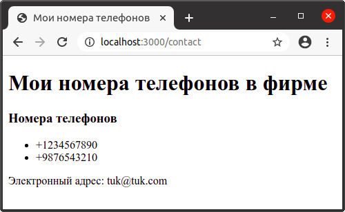

В приложениях Express для визуализации интерфейса, обычно, используют не стандартные файлы html, а специальные представления (шаблоны), из которых с помощью **движка представлений** (view engine) создаются html-файлы. Движок представлений еще называют **движком шаблонов** (template engine) или **шаблонизатором**, которых для Express написано довольно много: Handlebars, Dust, Pug, Jade, Nunjucks, EJS, и др. Все они функционально похожи и отличаются в небольших деталях. Выбор того или иного движка зависит от личных предпочтений.

Механизм шаблонов позволяет использовать в приложении статические файлы шаблонов (например, написанные на Pug), вместо которых затем вставляется какое-то динамическое содержимое с помощью кода javascript. Во время выполнения переменные в файле шаблона заменяются фактическими значениями, которые могут быть предоставлены вашим сервером. Шаблон преобразуется в статический HTML-файл, который отправляется клиенту. Этот подход упрощает проектирование HTML-страницы и позволяет отображать переменные на странице без необходимости выполнения вызова API от клиента.

[Pug](https://pugjs.org/api/getting-started.html) - это шаблонизатор и html-препроцессор, написанный на javascript для node.js. Pug имеет целый ряд преимуществ по сравнению с обычным HTML.

Установим пакет шаблонизатора Pug из [npm](https://www.npmjs.com/):

```
$ npm install pug
```

Создададим файл app.js со следующим кодом:

```js
const express = require("express")

const app = express()

app.set("view engine", "pug") // Указывает, что в качестве шаблонизатора используется Pug

/* Нижеприведенную строку кода можно не писать, так как каталог /views устанавливается по умолчанию. */
app.set("views", "./views") // Указывает на каталог, в котором находятся файлы шаблонов.

app.use("/contact", function(req, res) {
  res.render("contact", {
    //"contact" - это имя файла шаблона в каталоге views
    title: "Мои номера телефонов",
    phonesVisible: true,
    phones: ["+1234567890", "+9876543210"],
    email: "tuk@tuk.com",
  })
})

app.use("/", function(req, res) {
  res.send("Главная страница")
})
app.listen(3000)
```

Затем добавим в папку `views` файл `contact.pug` со следующим кодом:

```pug
<!DOCTYPE html>
<html>
<head>
    <title>#{title}</title> <!-- Для данных внутри html-элементов применяются теги `#{выражение}` -->
    <meta name='viewport', content="initial-scale=1.0, width=device-width" />
    <meta charset="utf-8" />
</head>
<body>

    <h1>#{title} в фирме</h1>

    if phonesVisible
        <h3>Номера телефонов</h3>
        <ul>
            each phone in phones
                <li>#{phone}</li>
        </ul>
    else
        <h3>Телефоны не указаны</h3>
    <p>Электронный адрес: #{email}</p>
</body>
<html>
```

В коде выше выражение `each phone in phones` представляет собой цикл. В нем `phone` - переменная, а `phones` - массив. Значения из массива `phones` с помощью перебора подставляются в переменную `phone` и выводятся на страницу в виде списка. Также в вышеприведенном коде есть условный оператор `if...else`, который работает также, как и условный оператор в других языках программирования.

Если теперь запустить проект и обратиться по адресу `http://localhost:3000/contact` приложение сгенерирует веб-страницу:



Pug позволяет писать с помощью сокращенной html-разметки. Перепишем код в файле `contact.pug`:

```pug
doctype html
html
	head
		title=title
		meta(charset='utf-8')
		meta(name='viewport', content="initial-scale=1.0, width=device-width")

	body

		h1 #{title} в фирме

		if phonesVisible
			h3 Номера телефонов
			ul
				each phone in phones
					li=phone

		else
			h3 Телефоны не указаны
		p Электронный адрес: #{email}
```
