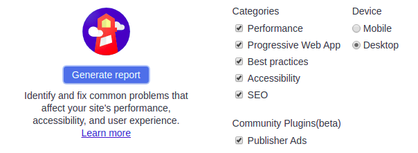
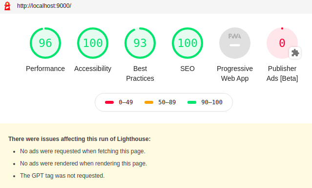

Это последняя статья из серии “Руководство по Gatsby”

В предыдущих частях изучалось следующее:

- создание сайтов Gatsby
- создание страниц и компонентов
- компоненты стиля
- добавление плагинов на сайт
- данные source и transform
- использование GraphQL для запроса данных
- программное создание страниц из данных

В этом заключительном разделе показываются общие шаги по подготовке сайта к работе, инструмент диагностики [Lighthouse](https://developers.google.com/web/tools/lighthouse/) и плагины, которые часто используются на Gatsby-сайтах.

## Как выполнить тест с помощью Lighthouse

Lighthouse - автоматизированный инструмент с открытым исходным кодом для улучшения качества веб-страниц. Lighthouse проверяет на веб-страницах производительность, доступность, PWA и др. Lighthouse входит в инструменты разработчика Chrome и позволяет проводить тесты и  обнаруживать ошибки. Скорость и доступность сайта увеличатся если устранить эти ошибки и внедрить улучшения, которые предлагает Lighthouse.

Сначала, создайте рабочую сборку Gatsby сайта. Сервер Gatsby оптимизирован для ускорения разработки, но сайт, который создает сервер, хотя и похож на рабочую версию, не оптимизирован как надо.

### Создание рабочей сборки

1. Остановите сервер разработки если он еще работает и выполните следующую команду:

```shell
gatsby build
```

Эта команда делает рабочую сборку и выводит статические файлы в каталог `public`.

2. Чтобы просмотреть рабочий сайт локально, выполните:

```shell
gatsby serve
```

После ввода этой команды, перейдите по адресу http://localhost:9000.

### Выполнение теста в Lighthouse

1. Откройте сайт с помощью браузера Chrome в режиме Инкогнито, чтобы никакие расширения не мешали тесту. Затем, откройте в Хроме инструменты разработчика DevTools.

2. Нажмите на вкладку “Audits”, где появится экран, который выглядит следующим образом:



3. Чтобы выполнить тест нажмите кнопку “Generate report” (по умолчанию выбраны все доступные типы теста). После завершения теста появятся результаты, которые выглядят следующим образом:



Из тестов видно, что производительность Gatsby превосходная из коробки, но не хватает некоторых вещей для PWA, Accessibility, Best Practices и SEO, которые улучшат результаты и сделают сайт намного дружелюбнее для посетителей и поисковиков.

Оценка в категории “Progressive Web App” довольно скромная, поэтому, попробуем разобраться с этим.

Progressive Web App или PWA - это веб-сайты, которые похожи на приложения благодаря использованию функционала в современных браузерах. В [обзоре Google](https://developers.google.com/web/progressive-web-apps/) освещается, что определяет работу PWA.

Ниже приводятся три [базовых требований для PWA](https://alistapart.com/article/yes-that-web-project-should-be-a-pwa#section1):

Включение манифеста веб-приложения
Использование Service Worker
Добавление метаданных страницы

## Добавление файла манифеста

Цитата от [Google](https://developers.google.com/web/fundamentals/web-app-manifest/):

> Манифест веб-приложения - JSON-файл, который сообщает браузеру о веб-приложении и о поведении этого приложения при “установке” на пользовательском мобильном устройстве или компьютере.

[Плагин манифеста](https://www.gatsbyjs.org/packages/gatsby-plugin-manifest/) настраивает Gatsby для создания файла manifest.webmanifest для каждой сборки сайта.

### Использование gatsby-plugin-manifest

1. Установите плагин:

```shell
npm install --save gatsby-plugin-manifest
```

2. Добавьте значок приложения в `src/images/icon.png`. Если у вас нет значка, то для этого урока воспользуйтесь [этим](https://raw.githubusercontent.com/gatsbyjs/gatsby/master/docs/tutorial/part-eight/icon.png). Значок необходим для построения изображений манифеста. Для получения дополнительной информации обратитесь к документации по [`gatsby-plugin-manifest`](https://github.com/gatsbyjs/gatsby/blob/master/packages/gatsby-plugin-manifest/README.md)

3. Добавьте плагин в массив `plugins` файла `gatsby-config.js`.

```javascript:title=gatsby-config.js
{
  plugins: [
    {
      resolve: `gatsby-plugin-manifest`,
      options: {
        name: `GatsbyJS`,
        short_name: `GatsbyJS`,
        start_url: `/`,
        background_color: `#6b37bf`,
        theme_color: `#6b37bf`,
        // Enables "Add to Homescreen" prompt and disables browser UI (including back button)
        // see https://developers.google.com/web/fundamentals/web-app-manifest/#display
        display: `standalone`,
        icon: `src/images/icon.png`, // This path is relative to the root of the site.
      },
    },
  ]
}
```

Это все, что вам необходимо, чтобы начать работу с добавлением веб-манифеста на Gatsby сайт. Дополнительно о плагине читайте [справку](https://www.gatsbyjs.org/packages/gatsby-plugin-manifest/?=gatsby-plugin-manifest#automatic-mode).

## Добавление офлайн поддержки

Использование [Service Worker](https://developer.mozilla.org/en-US/docs/Web/API/Service_Worker_API) является еще одним требованием к веб-сайту, чтобы квалифицироваться как PWA. Service Worker работает в фоновом режиме и, в зависимости от подключения к сети, решает, обслуживать сетевое либо кэшированное содержимое, что обеспечивает бесперебойную управляемую автономную работу.

[gatsby-plugin-offline](https://www.gatsbyjs.org/packages/gatsby-plugin-offline/) делает сайт автономным и более устойчивым к плохим сетевым условиям, создавая Service Worker для сайта.

### Использование gatsby-plugin-offline

1. Установите плагин:

```shell
npm install --save gatsby-plugin-offline
```

2. Добавьте плагин в массив `plugins` файла `gatsby-config.js`.

```javascript:title=gatsby-config.js
{
  plugins: [
    {
      resolve: `gatsby-plugin-manifest`,
      options: {
        name: `GatsbyJS`,
        short_name: `GatsbyJS`,
        start_url: `/`,
        background_color: `#6b37bf`,
        theme_color: `#6b37bf`,
        // Enables "Add to Homescreen" prompt and disables browser UI (including back button)
        // see https://developers.google.com/web/fundamentals/web-app-manifest/#display
        display: `standalone`,
        icon: `src/images/icon.png`, // This path is relative to the root of the site.
      },
    },
    // highlight-next-line
    `gatsby-plugin-offline`,
  ]
}
```

Это все, что нужно, для работы с Service Worker в Gatsby.

Чтобы офлайн плагин кэшировал созданный `manifest.webmanifest` нужно, чтобы офлайн плагин указывался после плагина манифеста, .

## Добавление метаданных страницы

Метаданные, такие как заголовок или описание, помогают поисковикам Google, Yandex и др. понять контент и решить, когда этот контент отображать в результатах поиска.

[React Helmet](https://github.com/nfl/react-helmet) - пакет, который содержит интерфейс React компонента, чтобы управлять [заголовком документа](https://developer.mozilla.org/en-US/docs/Web/HTML/Element/head).

Gatsby поддерживает [плагин react helmet](https://www.gatsbyjs.org/packages/gatsby-plugin-react-helmet/) для отображения данных сервера, добавленных с помощью React Helmet. С помощью плагина атрибуты, добавленные в React Helmet, добавляются к статическим HTML-страницам, которые создает Gatsby.

### Использование React Helmet и gatsby-plugin-react-helmet

1. Установите оба пакета:

```shell
npm install --save gatsby-plugin-react-helmet react-helmet
```

2. Добавьте плагин в массив `plugins` файла `gatsby-config.js`

```javascript:title=gatsby-config.js
{
  plugins: [
    {
      resolve: `gatsby-plugin-manifest`,
      options: {
        name: `GatsbyJS`,
        short_name: `GatsbyJS`,
        start_url: `/`,
        background_color: `#6b37bf`,
        theme_color: `#6b37bf`,
        // Enables "Add to Homescreen" prompt and disables browser UI (including back button)
        // see https://developers.google.com/web/fundamentals/web-app-manifest/#display
        display: `standalone`,
        icon: `src/images/icon.png`, // This path is relative to the root of the site.
      },
    },
    `gatsby-plugin-offline`,
    // highlight-next-line
    `gatsby-plugin-react-helmet`,
  ]
}
```

3. Используйте `React Helmet` на странице:

```jsx
import React from "react"
import { Helmet } from "react-helmet"

class Application extends React.Component {
  render() {
    return (
      <div className="application">
        {/* highlight-start */}
        <Helmet>
          <meta charSet="utf-8" />
          <title>My Title</title>
          <link rel="canonical" href="http://mysite.com/example" />
        </Helmet>
        ...
        {/* highlight-end */}
      </div>
    )
  }
}
```

Приведенный выше пример взят из [React Helmet docs](https://github.com/nfl/react-helmet#example).


## Дальнейшие действия

### Официальная документация

- [Официальная документация](https://www.gatsbyjs.org/docs/): просмотрите официальную документацию 
  - [Быстрый старт](https://www.gatsbyjs.org/docs/quick-start/), 
  - [Подробные руководства](https://www.gatsbyjs.org/docs/preparing-your-environment/), 
  - [ссылки на API](https://www.gatsbyjs.org/docs/gatsby-link/) и другое.

### Официальные Плагины

- [Официальные Плагины](https://github.com/gatsbyjs/gatsby/tree/master/packages): Полный список всех официальных плагинов, поддерживаемых Gatsby.

### Официальные Стартеры

1. [Gatsby Стартер по умолчанию](https://github.com/gatsbyjs/gatsby-starter-default): Начните проект с этого стандартного шаблона. Этот скелетный стартер поставляется с конфигурационными файлами Gatsby, которые вам могут понадобиться. _[рабочий пример](https://gatsbyjs.github.io/gatsby-starter-default/)_
2. [Gatsby Стартер блога](https://github.com/gatsbyjs/gatsby-starter-blog): Gatsby стартер для создания классного и быстрого блога. _[рабочий пример](https://gatsbyjs.github.io/gatsby-starter-blog/)_
3.  [Gatsby Стартер "Hello-World"](https://github.com/gatsbyjs/gatsby-starter-hello-world): Gatsby стартер с голыми предметами первой необходимости, необходимыми для сайта Gatsby. _[рабочий пример](https://gatsby-starter-hello-world-demo.netlify.com/)_


[Дополнительные руководства](https://www.gatsbyjs.org/tutorial/additional-tutorials/)

Поделитесь в [Твитере](https://twitter.com/search?q=%23buildwithgatsby) тем, что вы создали и [@упомяните нас](https://twitter.com/gatsbyjs)!

Внесите вклад! Прогуляйтесь по [открытым вопросам](https://github.com/gatsbyjs/gatsby/issues?q=is%3Aissue+is%3Aopen+label%3A%22help+wanted%22) репозитория Gatsby и [станьте вкладчиком](https://www.gatsbyjs.org/contributing/how-to-contribute/).


Узнайте, [“как внести вклад”](https://www.gatsbyjs.org/contributing/how-to-contribute/) в документы для еще большего количества идей.


Для написания этой статьи использованы следующие материалы:
- https://www.gatsbyjs.org/tutorial/part-eight/